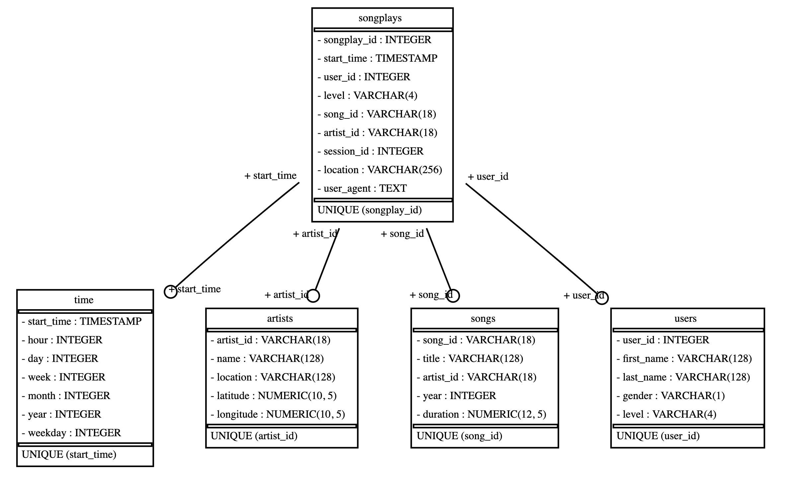

# Sparkify
## Building a User Listening Data Pipeline
## Project Purpose
This project, developed as part of the [Udacity Data Engineering Nanodegree](https://www.udacity.com/course/data-engineer-nanodegree--nd027), was developed to help the fictional company Sparkify build a data pipeline in order to analyze user listening habits on their platform. Sparkify is especially interested in finding out which songs their users are listening to.

## Raw Data Inputs

The raw data that is used to build this pipeline consists of two types of files - one containing song data and one containing user listening logs. Both types of files are in .json format.

### Song Files
Song files are nested in the project under the `data/song_data` directory. Each file contains a single .json object. For example:

    {
        "num_songs": 1,
        "artist_id": "ARD7TVE1187B99BFB1",
        "artist_latitude": null,
        "artist_longitude": null,
        "artist_location": "California - LA",
        "artist_name": "Casual",
        "song_id": "SOMZWCG12A8C13C480",
        "title": "I Didn't Mean To",
        "duration": 218.93179,
        "year": 0
    }

### Log Files
Log files are nested in the `data/log_data` directory. Each file contains .json objects on each line that represent a user action, along with information about the song played. For example:

    {
        "artist": "Des'ree",
        "auth": "Logged In",
        "firstName": "Kaylee",
        "gender": "F",
        "itemInSession": 1,
        "lastName": "Summers",
        "length": 246.30812,
        "level": "free",
        "location": "Phoenix-Mesa-Scottsdale, AZ",
        "method": "PUT",
        "page": "NextSong",
        "registration": 1540344794796.0,
        "sessionId": 139,
        "song": "You Gotta Be",
        "status": 200,
        "ts": 1541106106796,
        "userAgent": "\"Mozilla/5.0 (Windows NT 6.1; WOW64) AppleWebKit/537.36 (KHTML, like Gecko) Chrome/35.0.1916.153 Safari/537.36\"",
        "userId": "8"
}

The records that we care about in the context of this project are where `page` equals `NextSong`, as those are the records that represent a song being streamed by a user.

## Database
Since the purpose of this project is for analysis, a Data Warehouse design using a [Star Schema](https://en.wikipedia.org/wiki/Star_schema) is  used to organize the data. The database being used for this project is a [PostgreSQL](https://www.postgresql.org/) database.

### Schema Design
The schema design is broken up into the following 5 tables: `artists`, `songs`, `songplays`, `time` and `users`. The fact table in this design is the `songplays` table, which represents the action of a user selecting a song to play. The other 4 tables are dimension tables that represent details about the song play action, including information about the song, artist, time of selection and the user who selected it.

This design was chosen in order to simplify queries for analytical purposes. For example, the `time` table includes timestamp information broken down into hourly units, which simplifies the process of querying when filtering by date and time ranges. All of the dimension tables relate to the central `songplays` fact table in order to easily query information related to the songs that were played by users.

The following image shows the database schema and relations:

## ETL Pipeline
The data pipeline for this project aims to efficiently pull the relevant information that is needed from the `song_data` and `log_data` files in order to populate the database schema. The Python [pandas](https://pandas.pydata.org/) library is used to extract data from the .json files, transform data types where necessary, and then load the data into the PostgreSQL database using the [psycopg2](https://www.psycopg.org/) module. Records from `log_data` where `page` does not equal `NextSong` are filtered out right after the data is extracted. Another thing to note is that since song ID and artist ID are not found in the `log_data` files, these attributes must be queried from the already loaded `song` and `artist` tables in order to populate these fields in the `songplay` table.

## Python Scripts

To populate the database, enter the database credentials in the *create_database()* function of *create_tables.py*. Then run *create_database.py*. Once run, the database schema with the necessary tables will be created in the PostgreSQL database. Please note that every time *create_database.py* is run, the tables are completely dropped and recreated.

Once the tables have been created, enter the database credentials into *etl.py*. Then run *etl.py*. This script extracts the song and log data from the .json files, transforms it, and inserts it into the database tables created above. Please note that *etl.py* can be run more than once without errors, since the SQL queries used in *sql_queries.py* are written to handle duplicate entries in the files.

## Notebooks (.ipynb files)

The *etl.ipynb* file is a [Jupyter Notebook file](https://jupyter.org/) to assist with following along and developing the ETL code step-by-step. Additionally, *test.ipynb* can be used as a tool to query the database to check the status of each populated table.

## Example Queries
The following are some example queries that an analyst may want to run once the data has been populated in the database.

***Querying the Top 5 Songs Played for a Particular Month***

    SELECT
        sp.song_id,
	    sn.title,
	    sp.artist_id,
	    art.name,
	    tm.month,
	    tm.year,
	    count(sp.songplay_id) as plays
    FROM songplays sp
    INNER join songs sn on (sn.song_id = sp.song_id)
    INNER join artists art on (sn.artist_id = art.artist_id)
    INNER JOIN time tm on (sp.start_time = tm.start_time)
    WHERE tm.year = 2021 AND tm.month = 6
    GROUP BY
        sp.song_id,
        sn.title,
        sp.artist_id,
        art.name,
        tm.month,
        tm.year
    ORDER BY count(sp.songplay_id) desc
    LIMIT 5;

***Querying the Top 10 Listening Paid Users for a Particular Month***

    SELECT
        sp.user_id,
        u.first_name,
        u.last_name,
        u.gender,
        u.level,
        tm.month,
        tm.year,
        count(songplay_id)
    FROM songplays sp
    INNER JOIN users u on (sp.user_id = u.user_id)
    INNER JOIN time tm on (sp.start_time = tm.start_time)
    WHERE u.level = 'paid' and tm.month = 11 and tm.year = 2018
    GROUP BY
        sp.user_id,
        u.first_name,
        u.last_name,
        u.gender,
        u.level,
        tm.month,
        tm.year
    ORDER BY count(songplay_id) DESC
    LIMIT 10;

## Project Requirements

PostgreSQL (PostgreSQL 13 was used when developing this project)
Python 3

Python 3 Libraries

    pandas==1.3.0
    psycopg2==2.9.1
    jupyterlab==3.0.16
    ipython-sql==0.4.0
    sqlalchemy-schemadisplay-1.3

Graphics

In order to create the graph from the *generate_schema_graph.py* script, [graphviz](https://graphviz.org/) must be installed on your system. On a Mac, this can be done using brew with the command `brew install graphviz`.
